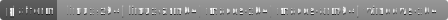
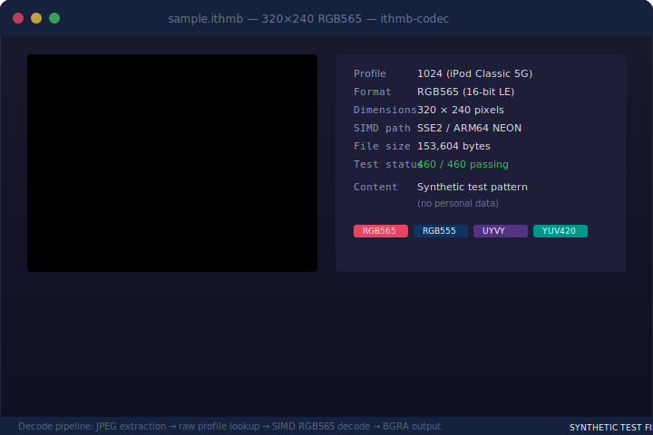
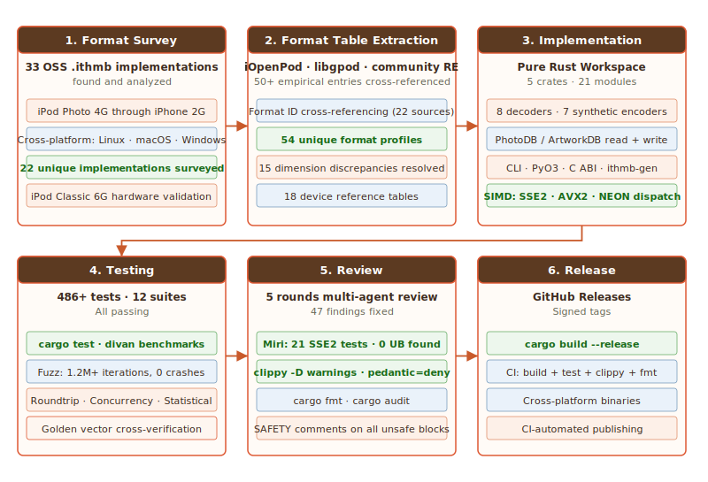

<div align="center">


# ITHMB Codec for ImageGlass v10

[](LICENSE)
[](https://rust-lang.org)
[](pymod/)

[](README.md#build-from-source)

<a href="./docs/badges/showcase.svg"></a>
<i>Concept render — not an actual screenshot.</i>
<hr style="max-width: 360px;">
<sub>Built with AI assistance — see <a href="./CREDITS.md">CREDITS.md</a></sub>
<br>
<a href="./CREDITS.md"></a>
<a href="./CREDITS.md"></a>
</div>
<br>

A pure Rust codec library, CLI tool, and ImageGlass v10 plugin for decoding and encoding Apple `.ithmb` thumbnail-cache files — the format used by iPod Classic/Nano/Photo/Video, iPhone 2G, and iPod Touch to store photo and album art thumbnails.

**Key features**

- 54 built-in profiles (+ 1 speculative disabled) covering known iPod/iPhone formats
- 8 decoders (RGB565, RGB555, ReorderedRGB555, UYVY, YCbCr420, CLCL, CL, JPEG)
- 7 synthetic encoders for all raw formats
- Roundtrip-proven tests (489+ passing)
- PhotoDB/ArtworkDB read, write, and integrity checking
- Multi-frame F-prefix raw file support
- BGR15 channel-swap for iPhone compatibility
- JPEG-embedded T-prefix decoding via pure Rust JPEG decoder
- Cross-platform (Linux x64/ARM64, macOS x64/ARM64, Windows x64)
- C ABI library for FFI integration into existing applications
- CLI tool for decoding, inspection, and frame extraction
- Python bindings (PyO3) for scripting and ML pipelines
- Full SIMD acceleration (SSE2+AVX2+NEON runtime dispatch) for YUV conversion paths

> Not an iOS 13+ thumbnail decoder — those use a different proprietary format.

**T-prefix** — contains an embedded JPEG. ✅ Fully supported (validated on 1,183 real files).

**F-prefix** (e.g. `F1019_1.ithmb`) — raw uncompressed thumbnails (RGB565, RGB555, UYVY, YCbCr420, CLCL nibble-chroma). ✅ Cross-referenced against iOpenPod's empirically validated set (50+ profiles across multiple iPod models) and confirmed on real iPod Classic 6G samples (F1061/F1055/F1060).

<table><tr><td>
🎖️ <strong>Special thanks to <a href="https://github.com/TheRealSavi">Savi</a> and the <a href="https://github.com/TheRealSavi/iOpenPod">iOpenPod</a> community</strong><br>
<em>For hardware validation — purchasing multiple iPod models and testing profiles across firmware generations. Profile tuning incorporates feedback from the iOpenPod community.</em>
</td></tr></table>

> [!TIP]
> New to `.ithmb` files? See [docs/what-is-this.md](docs/what-is-this.md) for a plain-english explainer.
> Confused by technical terms? See [docs/GLOSSARY.md](docs/GLOSSARY.md) for simple definitions.
> Want to extract photos from your iPod? See [docs/GUIDE.md](docs/GUIDE.md) for a walkthrough.

---

## Quick start

```bash
# Build from source
cargo build --release

# Decode a single .ithmb file to PNG
./target/release/ithmb my_photo.ithmb output.png

# Open a PhotoDB container and extract all thumbnails
./target/release/ithmb --open PhotoDB

# Or use from Python
pip install ithmb-python  # (not yet published — build from pymod/)
```

For detailed build instructions see [Build from source](#build-from-source).

## Table of Contents

- [How it works](#how-it-works)
- [Acknowledgments](#acknowledgments)
- [Install](#install)
- [Build from source](#build-from-source)
- [Testing & validation](#testing--validation)
- [Architecture](#architecture)
- [CLI tool](#cli-tool)
- [C ABI](#c-abi)
- [Profile Reference](#profile-reference)
- [Limitations](#limitations)
- [Troubleshooting](#troubleshooting)
- [Development](#development)
- [Contributions to the ecosystem](#contributions-to-the-ecosystem)
- [Changelog](#changelog)
- [License](#license)

---

## How it works

1. **Peek read** — reads the entire file into memory (peak memory dominated by the decoded bitmap, typically a few MB for iPhone photos). A 32 MB size guard prevents OOM from pathological input.

2. **JPEG scan** — checks for the JPEG SOI marker (`FF D8`) followed by JFIF or Exif within 512 bytes. On match, the JPEG payload is extracted (SOI→EOI), decoded via `jpeg-decoder`, and its EXIF orientation tag (0x0112) is exposed through the profile system.

3. **Raw fallback** — if no JPEG is found, the decoder matches the first 4 bytes (big-endian prefix) against 54 known profiles and runs the appropriate raw decoder (RGB565, RGB555, Reordered RGB555, UYVY, YCbCr420, YUV422 interlaced, CLCL nibble-chroma, or CL per-pixel chroma) to produce BGRA output. If the prefix doesn't match any known profile, the file is scanned for embedded JPEG markers (byte-level carving) before being rejected. Additional decoder variants can be activated via `profiles.json`: swapped chroma planes for YCbCr 4:2:0, per-pixel vs shared nibble chroma, endianness toggles, interlaced field ordering, padded frame handling, and channel-swap for BGR15 formats.

4. **PhotoDB/ArtworkDB** — Apple's iPod thumbnail databases (PhotoDB, ArtworkDB) use a binary chunk-based format (MHFD→MHSD→MHNI entries). When a file starts with `mhfd`, the codec parses the chunk tree, extracts individual thumbnails (inline pixel data or external `.ithmb` file references), and decodes each via the raw decoder matching its format ID. Read, write, and integrity checking are all supported.

### File size guard

> [!NOTE]
> Files larger than **32 MB** are rejected before reading to prevent OOM/DoS from pathological input. All known real .ithmb files are under 1 MB (max observed: 852 KB). The 32 MB limit covers ~40 max-size raw frames — far beyond any realistic thumbnail cache. Researched from scratch: no evidence that libgpod's commonly-cited 256 MB limit is a real firmware constant. Re-verified 2026-06-30: 40 max-size (P1007) frames = 31.64 MB, within limit.

## Acknowledgments

This project builds on the work of the iPod reverse-engineering community. Key references:

| Project | Author | Role |
|---------|--------|------|
| [iOpenPod](https://github.com/TheRealSavi/iOpenPod) | Savi | Primary format profile reference (50+ entries, empirically validated across multiple iPod models) |
| [libgpod](https://sourceforge.net/p/gtkpod/libgpod/ci/master/tree/) | community | PhotoDB/ArtworkDB chunk parser, format ID tables |
| [Keith's iPod Photo Reader](https://github.com/kebwi/Keiths_iPod_Photo_Reader) | kebwi | Original RE (2005), multi-frame confirmation, 13 decode methods |
| [clickwheel](https://github.com/dstaley/clickwheel) | dstaley | C# ArtworkDB read/write, 40+ format IDs |
| [OrgZ](https://github.com/FoxCouncil/OrgZ) | Fox | C# ArtworkDB+ithmb read/write |
| [pyithmb](https://github.com/wrinklykong/pyithmb) | wrinklykong | Python YUV reference decoder |

See [ACKNOWLEDGMENTS.md](ACKNOWLEDGMENTS.md) for the full list (33 projects, sample file sources, academic references, and color conversion standards).

### Contribution breakdown

| Area | What was done | Who |
|------|--------------|-----|
| **Community foundations** | iOpenPod, libgpod, clickwheel, Keith's RE, pyithmb, ithmb-rs, 15+ more | Community |
| **Hardware-validated profiles** | 50+ profiles empirically validated across multiple iPod models | Savi (iOpenPod) |
| **Sample contribution** | First public F-prefix .ithmb test vectors + 30 reference PNGs (CC0) | Reuhno |
| **AI execution** | Code, testing, documentation, CI, format cross-referencing | AI (Sisyphus + OMO) |
| **Project lead** | Vision, architecture, quality control, community engagement, verification, hardware coordination | B67687 |

---

## Install

### Library

Add the `ithmb-core` crate to your `Cargo.toml`:

```toml
[dependencies]
ithmb-core = { git = "https://github.com/B67687/Ithmb-Codec" }

Or use the CLI binary directly (see [releases](https://github.com/B67687/Ithmb-Codec/releases)).

### CLI binary

```bash
cargo install --git https://github.com/B67687/Ithmb-Codec ithmb-cli
```

This installs the `ithmb` binary.

---

## Build from source

### Requirements

- [Rust](https://rust-lang.org) 1.85 or later (edition 2024)
- A C compiler toolchain (for native code linking)

### Build

```bash
# Clone the repository
git clone https://github.com/B67687/Ithmb-Codec.git
cd Ithmb-Codec

# Build everything in release mode
cargo build --release
```

The workspace produces five artifacts:

| Crate | Binary/Library | Location |
|-------|---------------|----------|
| `ithmb-core`    | `libithmb_core.rlib` (static library)       | `target/release/`   |
| `ithmb-cli`     | `ithmb` (CLI binary)                        | `target/release/`   |
| `ithmb-core-cabi` | `libithmb_core_cabi.so` / `.dylib` / `.dll` (C ABI shared library) | `target/release/` |
| `ithmb-python`    | `libithmb_python.so` (PyO3 abi3-py312)      | `target/release/`   |
| `ithmb-gen`       | `ithmb-gen` (sample generator binary)       | `target/release/`   |

### Cross-compilation

Cross-compiling for other targets requires the appropriate target toolchain installed via `rustup target add`:

```bash
# Linux x86-64 (default on x64 hosts)
cargo build --release

# Linux ARM64 (aarch64)
rustup target add aarch64-unknown-linux-gnu
cargo build --release --target aarch64-unknown-linux-gnu

# macOS ARM64
rustup target add aarch64-apple-darwin
cargo build --release --target aarch64-apple-darwin

# Windows x64 (cross-compile from Linux)
rustup target add x86_64-pc-windows-gnu
cargo build --release --target x86_64-pc-windows-gnu
```

Enable SIMD acceleration:
```bash
cargo build --release --features simd
```

Available features: `simd` (SSE2/AVX2/NEON YUV conversion), `cache` (LRU raw file cache), `metrics` (decode timing counters).

---

## Testing & validation

```bash
cargo test
```

**489 tests** across 12 suites: roundtrip (RGB565: 65,536 values, RGB555: 32,768), fuzz (350+ inputs across all 8 decoders + 10,000 random byte mutations), 2 libfuzzer targets (1.2M+ iterations, 0 crashes), concurrency stress tests, statistical validation + golden vector verification, YUV tolerance, parsers, speculative decoder paths (CL, CLCL, rotation, swapped chroma), buffer-too-small guards, trailing-padding tolerance, JPEG carving fallback, multi-frame raw decode, rotation roundtrip, BGR15 channel-swap, PhotoDB roundtrip write/integrity/JPEG blob decode, device-specific format tables, corruption fuzz, format ID profile tests, encoder helpers (interlace fields + BT.601 color conversion), and decoder fallback paths.

**12 test suites** across the workspace, all passing.

**Real-device validation:**

- **iPod Classic 6G (Reuhno):** Real F1061/F1055/F1060 .ithmb files decoded successfully (BGR15 channel-swap, MSB replication — both confirmed correct). 30 reference PNGs match decoder output.
- **iOpenPod (TheRealSavi):** Empirically validated 50+ profiles across multiple iPod models purchased and tested. Confirmed "no known issues for iPod Nano and iPod Classic models." Our 54 profiles derive from the same format ID sources — hardware validation covered by iOpenPod's testing. See [iOpenPod#140](https://github.com/TheRealSavi/iOpenPod/issues/140).
- **iPhone 5 (iOS 7):** 956 T-prefix files — 100% extraction
- **Jakarade.com F00-F08:** 227 public T-prefix files — 100% JPEG+EXIF detection
- **MVS CTF 2026 (iOS 18):** iPhone 14 Plus full filesystem image scanned — 3 `.ithmb` files found but use a different proprietary format (iOS Photos framework, not decodable by this codec)

> Other known sources (FAU.edu, ~500 files) have live directory listings but downloads return 404. Not available for testing.

---

## Architecture

The project is organized as a Rust workspace with five crates:

### ithmb-core (library)

The core decoding library. All decoder logic lives here; wrappers for FFI, CLI use, or other languages call into this crate.

**21 modules** organized by domain:

| Module | Purpose |
|--------|---------|
|| `pipeline/` | Central dispatch — reads format prefix, dispatches to the correct decoder, applies crop/rotation post-processing; accepts `&AtomicBool` for cancellation |
| `jpeg.rs` | JPEG decoder wrapper (`jpeg-decoder` crate), EXIF orientation parsing |
| `rgb565.rs` | RGB565 decoder (16-bit RGB 5/6/5) |
| `rgb555.rs` | RGB555 decoder (15-bit RGB 5/5/5) |
| `reordered_rgb555.rs` | Reordered RGB555 decoder (byte-swapped variant) |
| `uyvy.rs` | UYVY 4:2:2 + Interlaced UYVY decoders (YUV→BGRA uses SSE2/AVX2/NEON with `--features simd`) |
| `ycbcr420.rs` | YCbCr 4:2:0 planar decoder (YUV→BGRA uses SSE2/AVX2/NEON with `--features simd`) |
| `clcl.rs` | CLCL nibble-chroma decoder (YUV→BGRA uses SSE2/AVX2/NEON with `--features simd`) |
| `cl.rs` | CL per-pixel chroma decoder (YUV→BGRA uses SSE2/AVX2/NEON with `--features simd`) |
| `yuv.rs` | Shared YUV conversion helpers, SSE2/AVX2/NEON runtime dispatch |
|| `simd/` | SSE2/AVX2/NEON YUV conversion dispatch (feature-gated), per-format SIMD sub-modules |
| `device_profiles.rs` | 18-device iPod/iPhone format lookup table |
| `enc.rs` | Synthetic encoders for all raw formats |
| `enc_helpers.rs` | Shared encoder helpers (InterlaceFields, BT.601) |
| `profile.rs` | Profile struct (IthmbVariantProfile, IthmbEncoding) |
| `profile_db.rs` | Built-in profile database (54 entries) |
| `profile_parser.rs` | JSON parser for external `profiles.json` |
| `cache.rs` | LRU raw file cache (feature-gated) |
| `metrics.rs` | Decode timing counters (feature-gated) |
| `error.rs` | Typed error enum (`DecodeError`) + decoded image type (`DecodedImage`) |
| `photodb/` | PhotoDB/ArtworkDB chunk parser, writer, integrity checker, and type definitions |

**Data flow:**

```
.ithmb file → JPEG/EXIF scan ──→ JPEG slice → jpeg-decoder crate → BGRA
                ├─ No JPEG → prefix lookup → raw decoder → BGRA
                │              └→ no prefix + JPEG scan → byte-level SOI carving → jpeg-decoder → BGRA
                │              └→ no prefix + mhfd magic → PhotoDB parser → entries → raw decoder → BGRA
                └─ external .ithmb reference → read file → raw decoder → BGRA
```

**Multi-frame support** — F-prefix `.ithmb` files may contain multiple concatenated raw frames (confirmed by Keith's iPod Photo Reader, ithmbrdr, libgpod, and iOpenPod). The codec detects frame count from file size. Callers can access individual frames via frame index (0-based); out-of-range indices return an error. JPEG-embedded T-prefix files are always single-frame.

### ithmb-cli (CLI binary)

A command-line tool for decoding, inspecting, and analyzing `.ithmb` files. Built with `clap` for argument parsing and `png` crate for PNG output.

```bash
# Decode a file to PNG
ithmb input.ithmb output.png

# Print file metadata only
ithmb --info input.ithmb

# List all known profiles
ithmb --list-profiles

# Extract a specific frame from a multi-frame file
ithmb --frame 2 input.ithmb output.png

# Raw BGRA output (no PNG encoding)
ithmb --raw input.ithmb output.bin
```

### ithmb-core-cabi (C ABI shared library)

A `cdylib` that implements the ImageGlass v10 native plugin ABI via `ig_plugin_get_api()`, enabling integration into the ImageGlass image viewer on Windows. The C ABI layer delegates all decode logic to `ithmb-core`. This is built separately from the core library and is only needed for ImageGlass plugin integration.

### ithmb-python (PyO3 bindings)

A `cdylib` exposing ithmb-core to Python 3.12+ via PyO3 (abi3-py312). Built with `maturin build`.

### ithmb-gen (sample generator)

A CLI tool for generating synthetic `.ithmb` test vectors and reference PNGs used during development.

<div align="center"></div>

---

## CLI tool

The `ithmb` CLI tool supports four modes:

| Command | Description |
|---------|-------------|
| `ithmb input.ithmb [output.png]` | Decode to PNG (auto-detects format from extension) |
| `ithmb --info input.ithmb` | Print metadata (size, prefix, profile, frame count) |
| `ithmb --list-profiles` | Print the 54-profile database as a formatted table |
| `ithmb --frame N input.ithmb [output.png]` | Extract frame N from a multi-frame file |

Output options: `--raw` for raw BGRA binary, `--format bin` for explicit binary, `.png` extension auto-selects PNG.

## Benchmarks

Decode throughput (divan, 256×256 with `--features simd`, Ryzen AI 9 HX 370):

| Decoder | Time | Throughput | vs Scalar |
|---------|------|-----------|-----------|
| RGB565 | **7.5 µs** | **35 GB/s** | **4.7×** SSE2 8px + AVX2 16px dispatch |
| RGB555 | **7.7 µs** | **34 GB/s** | **5.2×** SSE2 8px + AVX2 16px dispatch |
| CL | **49 µs** | **5.3 GB/s** | **3.1×** SSSE3 pshufb nibble + SSE4.1 packed YUV (inlined row) |
| CLCL | **2.9 µs** | **90 GB/s** | **71×** row-level SSE2 (separate plane layout) |
| UYVY | **17 µs** | **15 GB/s** | **4.0×** AVX2 16px vpshufb + packed clamp |
| YCbCr 4:2:0 | **38 µs** | **6.9 GB/s** | **2.3×** AVX2 8-macroblock batch |
| ReorderedRGB555 | **106 µs** | **2.5 GB/s** | **3.7×** LUT + incremental Morton (AVX2 gather slower) |
| JPEG | **54 µs** | **301 MB/s** | External crate (`jpeg-decoder`) |

Run with: `cargo bench --features simd`

### Performance Limits

Theoretical maximum throughput per format at 256×256 (L2 cache ~1 MB, ~100 GB/s bandwidth):

| Format | Current | Limit | Bottleneck | Room to improve |
|--------|---------|-------|------------|-----------------|
| RGB565 | **7.5 µs** | **7.5 µs** | L2 bandwidth saturated (35 GB/s) | **0%** — at hardware limit |
| RGB555 | **7.7 µs** | ~7.5 µs | L2 bandwidth | ~3% |
| CLCL | **2.9 µs** | ~2 µs | Nibble table lookup (4→8 bit expansion) | ~25% |
| CL | **49 µs** | ~15 µs | Per-pixel BT.601 YUV→BGRA (ALU throughput) | ~70% |
| UYVY | **17 µs** | ~8 µs | AVX2 vpshufb + vpmaddwd pipeline latency | ~50% |
| YCbCr 4:2:0 | **38 µs** | ~15 µs | Per-pixel YUV clamp+pack (same UYVY bottleneck) | ~60% |
| ReorderedRGB555 | **106 µs** | ~80 µs | Z-order Morton non-linear address pattern | ~25% |

Simple pixel unpack (RGB565, RGB555) is memory-bandwidth limited. YUV formats (UYVY, YCbCr420, CL, CLCL) are ALU-limited by per-pixel BT.601 arithmetic. CLCL achieves near-memory-bandwidth despite the ALU bottleneck because its plane-separated layout allows 8-pixel SSE2 row processing without address interleave overhead.
---


## C ABI

The `ithmb-core-cabi` crate compiles to a `cdylib` (`.so`/`.dylib`/`.dll`) exposing the ImageGlass v10 plugin ABI entry point `ig_plugin_get_api()`. This allows:

- Integration with [ImageGlass](https://imageglass.org) on Windows for native `.ithmb` viewing
- FFI integration from C/C++, Python (via `ctypes`/`cffi`), or any language with C FFI support
- Zero-overhead cross-language decode without subprocess calls

## Profile Reference

**54 known profiles** (+ 1 speculative disabled — see note in codebase) covering iPod Photo 4G through iPhone 2G and iPod Nano 7G. Max frame size: 480×864 (RGB565, 830 KB). See [PROFILES.md](PROFILES.md) for the full table with dimensions, encoding, and device mapping. External profiles can be added at runtime via `profiles.json`.

Each profile defines the pixel encoding, dimensions, byte length per frame, and post-processing flags (crop, rotation, channel swap, dimension swap, interlacing, padding).

---

## Limitations

> [!WARNING]
> **T-prefix (JPEG-embedded) validated on 1,183 real files (956 iPhone 5 + 227 Jakarade); F-prefix raw decoders validated on iPod Classic 6G samples (F1061/F1055/F1060).** Raw decoders exist for 54 known profiles and pass roundtrip tests (489+ total).
>
> **F-prefix decoder coverage is broad but not exhaustive.** 54 profiles cover known iPod/iPhone formats through iPod Nano 7G and iPhone 2G. Unknown formats from obscure firmware versions may still exist. [Open an issue](https://github.com/B67687/Ithmb-Codec/issues) if you encounter one.
>
> **JPEG SOI must be within the first 4 MB** of the file (covers all known real files). For unknown raw files, the codec falls back to byte-level JPEG carving.
>
> **Hardware validation details** — see [HARDWARE_GUIDE.md](HARDWARE_GUIDE.md) for the full device testing matrix and methodology.
>
> **SIMD acceleration** — SSE2 for YUV conversion paths (UYVY, YCbCr420, CL, CLCL). AVX2 and ARM NEON runtime dispatch via `--features simd`. RGB565/RGB555 pixel-unpack formats use auto-vectorized scalar loops (hand-written SIMD was 34× slower due to Intel AVX frequency downclock).

---

## Troubleshooting

| Symptom                      | Likely cause / What to do                                                                                               |
| ---------------------------- | ----------------------------------------------------------------------------------------------------------------------- |
|| File won't open              | May use an unknown format variant. [Open a codec issue](https://github.com/B67687/Ithmb-Codec/issues) with a sample.    |
|| Garbled image / wrong colors | JPEG false positive or raw decoder mismatch (rare). [Open a codec issue](https://github.com/B67687/Ithmb-Codec/issues). |
| "File too large" error       | File exceeds the **32 MB** guard — should never happen for normal iPhone photos. Open an issue if it does.              |

> [!TIP]
> If a file doesn't decode correctly, [open an issue](https://github.com/B67687/Ithmb-Codec/issues) with a sample link. You can also try [ithmb.org](https://ithmb.org) — a browser-based .ithmb decoder (offline, no upload) — to compare results.

---

## Development

The library was developed through iterative research, implementation, review, and release cycles:

1. **Format survey** — 33 open-source .ithmb implementations found and analyzed
2. **Format table extraction** — iOpenPod (50+ entries), libgpod, iLounge threads, and Keith's iPod Photo Reader provided dimension/encoding tables for 54 profiles
3. **Implementation** — Pure Rust workspace with 8 decoders, JPEG decode, PhotoDB/ArtworkDB support, CLI tooling, PyO3 Python bindings, and sample generator
4. **Testing** — 489+ unit tests across roundtrip, fuzz, libfuzzer, parsers, speculative paths, buffer-too-small guards, trailing-padding tolerance, JPEG carving fallback, multi-frame raw decode, rotation roundtrip, byte-level corruption fuzz, BGR15 channel-swap, PhotoDB roundtrip write, PhotoDB integrity, PhotoDB JPEG blob decode, device-specific format tables, concurrency stress tests, and format ID profile tests
5. **Review cycles** — 5 rounds of multi-agent review: ~47 findings fixed covering memory safety, threading, ABI compatibility, buffer overflow, integer overflow, and defense-in-depth
6. **Release** — Published via GitHub Releases

<div align="center"></div>

See [CHANGELOG.md](CHANGELOG.md) for the full version history.

### Quality pipeline

Quality checks run locally before release:

```bash
cargo clippy --all-targets -- -D warnings  # Lint
cargo test                                 # All tests (489+ across 12 suites)
cargo audit                                # Advisory check
cargo fuzz build                           # Fuzz targets compile check
```

## Contributions to the ecosystem

This project made several original contributions to the .ithmb reverse-engineering space. The full write-up is in [docs/ECOSYSTEM.md](docs/ECOSYSTEM.md).

- **54 profile cross-reference** — consolidated from 22 implementations, corrected 15 dimension errors, identified 18 new format IDs
- **PhotoDB/ArtworkDB read-write** — first OSS implementation that can write valid ArtworkDB from scratch
- **Device-specific format tables** — mapped which formats each of 18 iPod/iPhone generations actually uses
- **Hardware validation** — first systematic hardware confirmation via community collaboration with iOpenPod
- **Synthetic test vectors** — first public F-prefix test vectors (CC0) for raw .ithmb decoding
- **C#→Rust cross-verification** — pixel-for-pixel verified against C# reference across all 7 formats, both encode and decode
- **Clean-room Rust port** — full decode+encode+container pipeline verified with 489 tests, fuzzing (1.2M+ iterations), and Miri UB checks

## Changelog

See [CHANGELOG.md](CHANGELOG.md) for version history.

---

## License

MIT — see [LICENSE](LICENSE).

The original IthmbDecoder reference implementation (PR [#2316](https://github.com/d2phap/ImageGlass/pull/2316)) was GPL-3.0. This library is a clean-room implementation, informed by format behavior described in that PR but using no GPL code.
